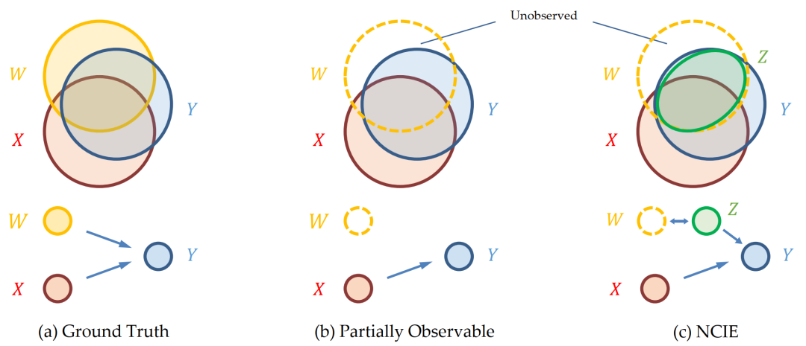

#### 基于神经网络的互信息估计（Mutual Information Neural Estimation）

参考文献：M. I. Belghazi, A. Baratin, S. Rajeswar, et al.: Mutual Information Neural Estimation, 2021 ICML.

##### 一、互信息与KL散度推导
两个连续的（一维或多维）随机变量 $X$、$Y$ 之间的互信息为：

$$
I(X; Y) = \int_{x\in\cal X} \int_{y\in\cal Y}P_{X,Y}(x, y) \log{\frac{P_{X,Y}(x, y)}{P_X(x)P_Y(y)}}{\rm d}x{\rm d}y
$$

等于如下形式的KL散度：

$$
I(X; Y) = D_{KL}\left(P_{X,Y}||P_X \otimes P_Y\right) \tag{1}
$$

其中，$P_X\otimes P_Y$ 为 $X$、$Y$ 边际概率密度的乘积。

##### 二、基于Donsker-Varadhan表示的KL散度下界估计

KL散度用于衡量任意两个连续分布 $P$ 和 $Q$ 之间的差异，其定义式为：

$$
D_{KL}(P||Q) = \int_{-\infty}^{+\infty}P(x)\log{\frac{P(x)}{Q(x)}}{\rm d}x \tag{2}
$$

根据Donsker-Varadhan表示，可知：

$$
\begin{align*} \tag{3}
    D_{KL}(P||Q) &= \sup\limits_{T:\Omega\rightarrow {\mathbb R}} {\mathbb E}_{P}[T] - \log\left({\mathbb E}_{Q}\left[e^T\right]\right)\\
    &=\sup\limits_{T:\Omega\rightarrow {\mathbb R}} \int_{-\infty}^{+\infty}T(x)P(x){\rm d}x - \log \int_{-\infty}^{+\infty} \exp\left(T(x)\right) Q(x){\rm d}x
\end{align*}
$$

其中，$T$ 为从分布 $P$ 对应空间 $\Omega$ 到实数域 $\mathbb R$ 的映射。

设 $\cal F$ 为满足映射 $T: \Omega\rightarrow {\mathbb R}$ 的任意函数族，则：

$$
\begin{align*}
    D_{KL}(P||Q) &= \sup\limits_{T \in \cal F} {\mathbb E}_{P}[T] - \log\left({\mathbb E}_{Q}\left[e^T\right]\right) \tag{4}
\end{align*}
$$

注意，在下文中，特定的神经网络结构对应一族函数，在此情形下映射 $T$ 仅与神经网络参数 $\theta$ 有关，记为 $T_\theta$。将对应取得式(4)下界的函数记为 $T_{\theta^*}$，对应的神经网络参数为 $\theta^*$。这样一来：

$$
D_{KL}(P||Q) \geq {\mathbb E}_{P}[T_{\theta^*}] - \log\left({\mathbb E}_{Q}\left[e^{T_{\theta^*}}\right]\right) \tag{5}
$$

##### 三、基于神经网络梯度下降的互信息估计

结合式(1)和(5)，可得：

$$
\begin{align*} \tag{6}
    I(X; Y) &= D_{KL}\left(P_{X,Y}||P_X \otimes P_Y\right) \\
    &\geq {\mathbb E}_{P_{X,Y}}[T_{\theta^*}] - \log\left({\mathbb E}_{P_X\otimes P_Y}\left[e^{T_{\theta^*}}\right]\right)
\end{align*}
$$

此时，$T$ 为从分布 $P_{X,Y}$ 对应空间 $\Omega$ 到实数域 $\mathbb R$ 的映射。在确定的神经网络结构下，$T$ 仅与神经网络参数 $\theta$ 有关，设所有参数集合为 $\Theta$，则有

$$
\begin{align*} \tag{7}
    I(X;Y) &\geq I_{T_{\theta^*}}(X;Y) \\
    &= \sup\limits_{\theta \in \Theta} {\mathbb E}_{P_{X,Y}}[T_\theta] - \log\left({\mathbb E}_{P_X\otimes P_Y}\left[e^{T_{\theta}}\right]\right)
\end{align*}
$$

下界如何获得呢？—— 梯度下降！这样就将互信息估计与神经网络的训练过程结合起来了。论文将采用该方式的互信息估计器命名为MINE，记为 ${\hat I}_{\Theta}$。对应实现的神经网络命名为统计网络（statistics network）。

但是下界值并不表示最终估计收敛值，因此Belghazi等在论文中证明了MINE满足**强一致性（strong consistency）**：对于任意实数 $\epsilon > 0$，存在一个正整数 $N$ 和特定的统计网络使得：

$$
\forall n \geq N, |I(X;Y) - {\hat I}_{\Theta}(X;Y)_n| \leq \epsilon \tag{8}
$$

这点证明将MINE对互信息的下界估计转为一致估计，很关键。

此外，作者还在其论文中提出了MINE的具体训练实施框架，其中针对Mini-Batch训练采用了如滑动平均等的 **偏差校正梯度（bias corrected gradients）** 计算，用以克服在随机梯度中的估计偏差问题，此处省略。

##### 四、应用案例：基于信息瓶颈原理的隐藏变量估计

MINE可用于深度学习中基于信息论的损失函数设计和计算。本文以隐藏变量估计为例对其应用原理进行介绍，参考论文：K.Leong, Y. Xiu, B. Chen, et al.: Neural Causal Information Extractor for Unobserved Causes, Entropy, 2024。[集智俱乐部：利用神经网络提取系统中未被观测到变量的信息](http://mp.weixin.qq.com/s?__biz=MzIzMjQyNzQ5MA==&mid=2247686139&idx=2&sn=2c9a79b6d083d87d6279d64e3eeafee8&chksm=e8994d76dfeec460bd9e156ae1e7a1639df9233347e4350c4ca7d5da02ff0d54211e9714fd12&mpshare=1&scene=24&srcid=0404QzHzphU89elLc3xW3J9s&sharer_shareinfo=5166579513d8d215d466ab71da145d07&sharer_shareinfo_first=5166579513d8d215d466ab71da145d07#rd)

问题描述：
> 在现实场景中，通常我们研究的系统不是全部可观测的，它们包含了一些不可能或者很难观测到的变量...目前已有的数据集也很难收集到所有因变量。因变量的缺失导致无法精确描述目标变量的因果过程，也无法准确拟合预测模型。
> 
> 

> 
> 作者考虑了两个假设：1. 因变量X会给目标变量Y提供条件互信息，2. 目标变量Y的信息会被全部因变量（可观测的X和不可观测的W）的信息所覆盖。所以，在现实场景中，可观测的因变量X只能给目标变量Y提供一部分的信息，而另一部分是由未被观测的W所提供的。这篇工作的目标是生成隐变量Z，使得隐变量Z携带和表征未被观测的W的那部分信息。除了使隐变量Z表征W之外，这篇工作的另一主要贡献在于提出并实现了一种比较直接简单的利用神经网络最大化互信息和条件互信息的方法。

从信息论角度来看，我们希望通过神经网络 $f$ 所构建的隐藏变量 $Z = f(W)$ 能够充分表达上述维恩图中其他变量 $W$ 与 $Y$ 的信息交集（即互信息 $I(Y;W)$）中扣除掉已观测原因 $X$ 的部分，因此对应的损失函数为：

$$
\max I(Y;Z(f)|X) \tag{9}
$$

上述条件互信息 $I(Y;Z(f)|X)$ 可转化为两互信息之差：

$$
I(Y;Z(f)|X) = I(Y;X, Z(f)) - I(Y; X) \tag{10}
$$

注意到 $I(Y; X)$ 为固定值，因此损失函数可进一步设计为：

$$
\max\limits_{f} I(Y; X, Z(f)) = I(Y; X, f(W)) \tag{11}
$$

当然，作者也提到该损失函数无法确保 $Z$ 中尽可能排除已有的 $X$信息，即与 $X$ 尽可能独立。可以将损失函数进一步改写为：

$$
\max\limits_{f} I(Y; X, Z(f)) - \beta\cdot I(X; Z(f)) \tag{12}
$$

其中参数 $\beta$ 用于限制 $Z$ 中关于 $X$ 信息的保留量。

最后，将MINE嵌入到神经网络 $f$ 的训练过程便可对式(12)中的互信息值进行计算。