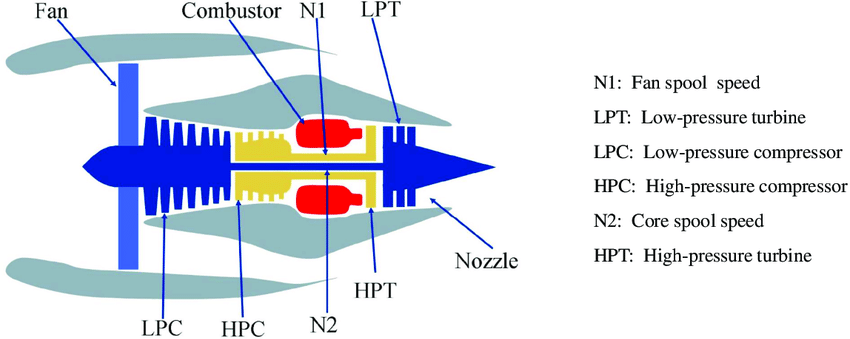
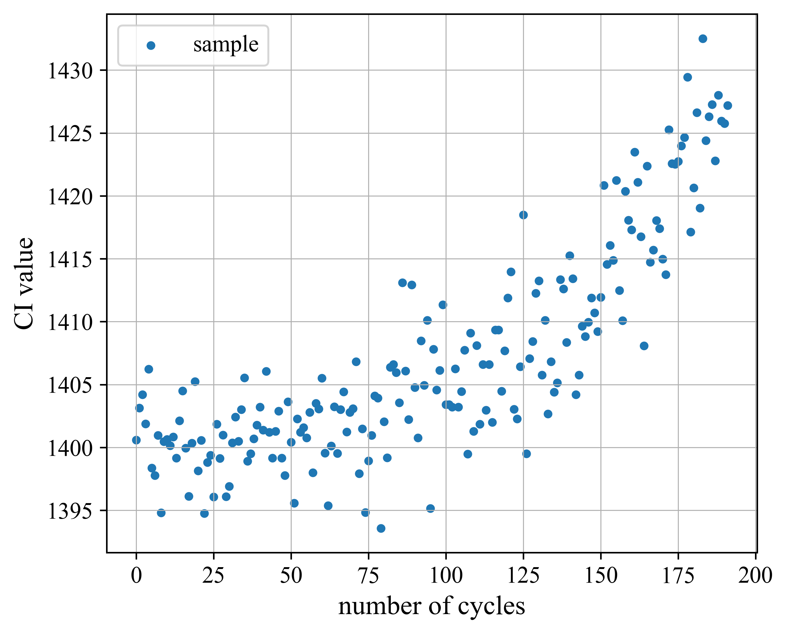
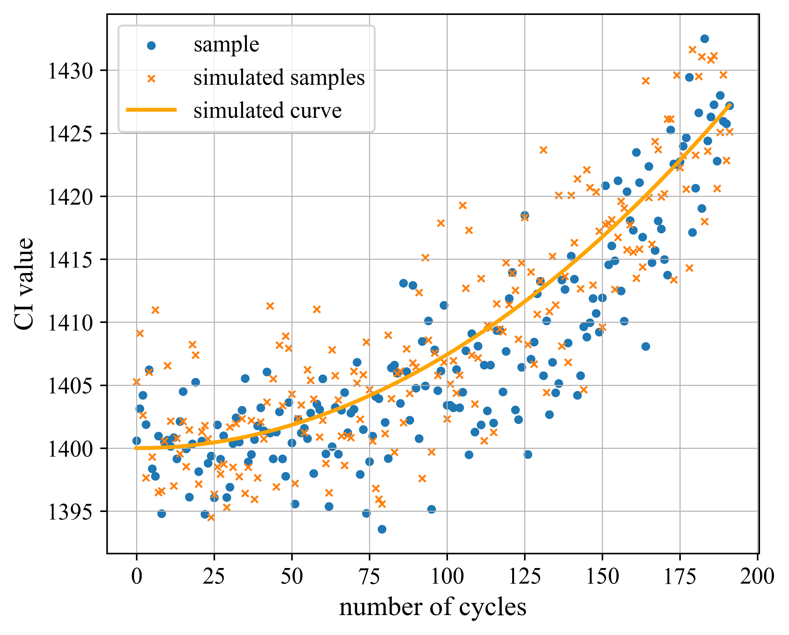
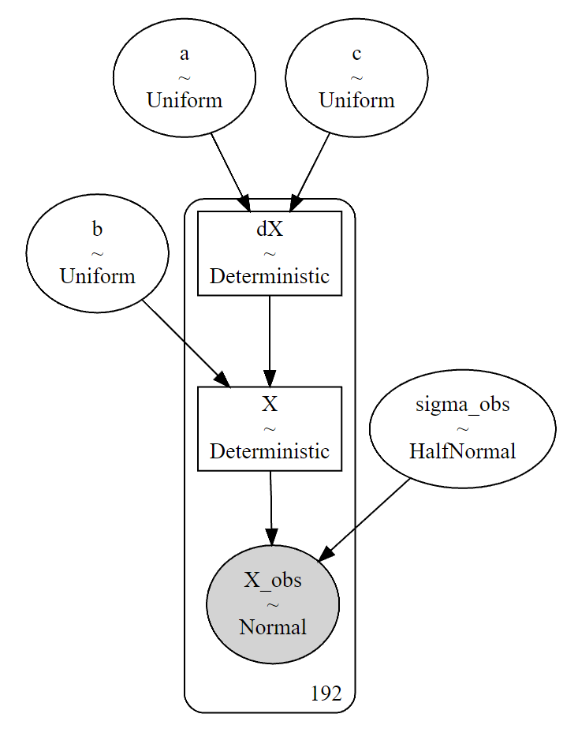
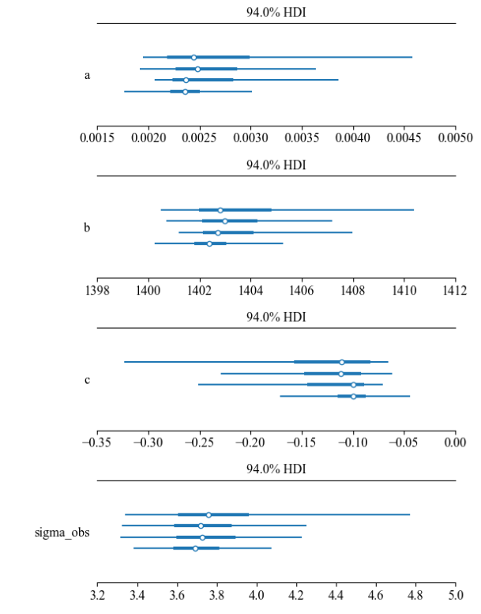
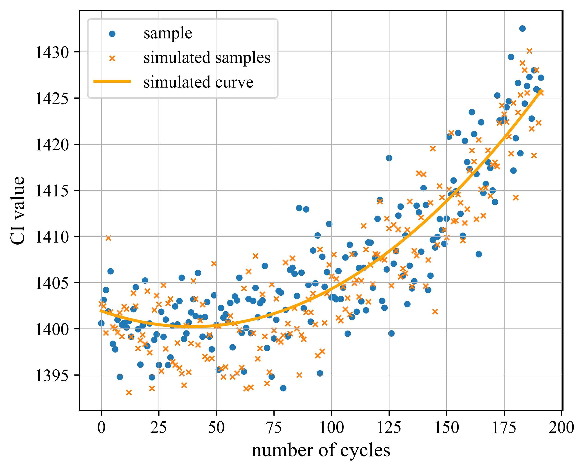

### 基于C-MAPSS涡扇发动机数据集的退化方程参数估计

#### 一、数据集介绍

C-MAPSS（Commercial Modular Aero-Propulsion System Simulation）数据集是由NASA提供的用于研究航空发动机剩余寿命预测的标准数据集。该数据集包含了大量的发动机运行数据，包括传感器测量值、工作循环次数等信息。通过对这些数据进行分析和建模，可以估计发动机的退化状态方程参数，并预测剩余寿命（Rest Useful Life, RUL）。

数据集对应的发动机原理图如下所示：

{width=500}

每台发动机上都有多个传感器，用于测量发动机的各种状态指标，如温度、压力、振动等。同时，每个发动机都有一个初始状态，即初始的CI（condition indicator）值。通过对传感器测量值和工作循环次数的分析，可以建立发动机的退化状态方程，用于描述发动机在运行过程中的退化情况。

C-MAPSS数据集是航空发动机剩余寿命预测领域的重要资源，被广泛应用于学术研究和工业实践中。通过对该数据集的研究，可以提高发动机的可靠性和安全性，减少维修成本，延长发动机的使用寿命。

C-MAPSS数据集中的每个发动机都有多个传感器测量值，以及对应的工作循环次数。数据集中的每一行代表一个时刻的数据记录，包含以下字段：

1. unit number：发动机编号，从1开始递增。
2. time in cycles：工作循环次数。
3. operational setting 1：操作设置1。
4. operational setting 2：操作设置2。
5. operational setting 3：操作设置3。
6. sensor measurement 1：传感器测量值1。
7. sensor measurement 2：传感器测量值2。
8. ...
9. sensor measurement n：传感器测量值n。

数据集中的每个发动机的工作循环次数是递增的，即每个发动机的第一个数据记录的工作循环次数为1，第二个数据记录的工作循环次数为2，依此类推。

通过对这些传感器测量值和工作循环次数的分析，可以建立发动机的退化状态方程，并预测剩余寿命。

#### 二、退化状态方程设计

以第一台发动机（unit_nb = 1）的第四个传感器测量值（s4）为状态指示CI值，绘制其随发动机工作循环次数的变化如下图所示：

{width=400}

可见，该CI值随工作循环次数的增加呈现**加速上升**趋势，并在接近1430时发生失效。

假设CI值变化的速度随时间线性递增，则有相邻时刻的状态量关系：

$$
\begin{align*}
    x_{t + 1} = x_t + \Delta x_t \tag{1}\\
    \Delta x_{t + 1} = \Delta x_t + a \\
\end{align*}
$$

写成矩阵形式有：

$$
\left[
    \begin{array}{cc}
    x_{t+1} \\
    \Delta x_{t+1} \\
    \end{array}
\right] = 
\left[
    \begin{array}{cc}
        1 & 1 \\
        0 & 1 \\
    \end{array}
\right] 
\left[
    \begin{array}{cc}
        x_t \\
        \Delta x_t \\
    \end{array}
\right] + 
\left[
    \begin{array}{cc}
        0 \\
        a \\
    \end{array}
\right] \tag{2}
$$

状态值与观测值的关系为：

$$
\begin{align*}
    \hat x_{t+1} & = x_{t + 1} + \varepsilon_{t + 1} \tag{3}\\ 
    \hat x_{t} & = x_{t} + \varepsilon_{t} \\
\end{align*}
$$

其中，噪声 $ \varepsilon_{t}$ 和 $ \varepsilon_{t}$ 均满足均值为0，标准差为 $\sigma_{\rm obs}$ 的正态分布 ${\rm Norm}(0, \sigma_{\rm obs})$：

$$
\begin{align*}
    \varepsilon_{t} \sim {\rm Norm}(0, \sigma_{\rm obs}) \\ \tag{4}
    \varepsilon_{t + 1}  \sim {\rm Norm}(0, \sigma_{\rm obs})
\end{align*}
$$

**待解决的问题为：基于对应于S4的状态指示量实际观测样本 $\left\{\hat x\right\}$ ，获得CI的状态变化 $\left\{x\right\}$ 以及对应的退化方程参数估计。**

设CI状态值 $x$ 及其变化速度 $\Delta x$ 的初始值分别为 $b$ 和 $c$，则待估计的参数有：

* $a$：CI变化的加速度；
* $b$：CI初始状态值；
* $c$：CI初始状态变化速度；
* $\sigma_{\rm obs}$：观测噪声标准差。

#### 三、前向模拟

如果给出一套 $a$、$b$、$c$ 和 $\sigma_{\rm obs}$ 的值，则可按照式(2)至(4)获得的CI模拟观测样本 $\left\{\hat x_{\rm sim}\right\}$。 $\left\{\hat x_{\rm sim}\right\}$ 与实际观测样本 $\left\{\hat x\right\}$ 越接近，则对应的参数设置也应与过程实际相匹配，这便是参数估计的原理。

下图显示了手动设置 $a=0.0015$、$b=1400$、$c=0$ 和 $\sigma_{\rm obs}=5$ 时所得模拟观测样本（黄色散点）和状态变化曲线（黄色曲线）与实际样本（蓝色散点）之间的比较：

{width=400}

可以看到上述参数设置所得拟合效果较好，接下来，我们将基于贝叶斯方法对各参数对应观测样本的取值分布进行计算和讨论。

#### 四、退化方程的参数估计

本文使用PyMC建立贝叶斯参数估计模型，代码见本文末尾链接。各参数的先验分布设置如下：

$$
\begin{align*}
    a &\sim {\rm Uniform}(lb=0.0, ub=1.0) \\ \tag{5}
    b &\sim {\rm Uniform}(lb=1000, ub=3000) \\
    c &\sim {\rm Uniform}(lb=-10, ub=10) \\
    \sigma_{\rm obs} &\sim \rm HalfNormal(\tau=1.0) \\
\end{align*}
$$

可见各先验分布具有较宽的范围，后续计算将结合观测数据缩小各参数的不确定性，获得准确的后验分布估计。

设模拟时刻（即工作循环次数）为 $\vec{t} = [0, 1, 2, \cdots, N - 1]^T$，则CI速度的状态值为：

$$
\Delta \vec{x} = a \cdot \vec{t} + c \tag{6}
$$

进一步地，可得CI状态值为：

$$
\vec{x} = \bold{T} \cdot \Delta \vec{x} + \vec{b} \tag{7}
$$

其中，举证 $\bold{T}$ 和向量 $\vec{b}$ 分别为：

$$
\bold{T} = \left[
    \begin{array}{cc}
        1& & & & & & \\
        1&1& & & & & \\
        1&1&1& & & & \\
         & & &\cdots&&& \\
        1&1&1&\cdots&1&1& \\
    \end{array}
\right], \vec{b} = \left[
    \begin{array}{cc}
        b \\
        b \\
        \vdots \\
        b
    \end{array}
\right]
$$

基于上式，编写代码建立PyMC参数估计模型，各参数和样本之间的关系图为：

{width=400}

由于所有待估计参数 $a$、$b$、$c$ 和 $\sigma_{\rm obs}$ 均为连续变量，因此采用NUTS采样器进行估计（当然，选择Metropolis采样器也可以）。一共独立进行4次采样，每次采样6000轮，从第1000个样本开始计算统计指标。最终，从采样结果中得到各参数后验分布的94%最高密度区间（High-Density Interval，HDI）分布如下：

{width=600}

每个参数对应4条独立的采样链结果。从图中可见，各链所得HDI结果一致，因此可得可靠的参数估计。最终得到四个参数的最大后验估计（Maximum A Posteriori Probability，MAP）结果如下：

| 参数 | MAP估计值 |
|:----:|:--------:|
|  $a$ |  0.002218 |
|  $b$ | 1401.9277 |
|  $c$ | -0.08599  |
| $\sigma_{\rm obs}$ | 3.6357 |

将上述后验估计结果代入上位前向模拟，得到结果如下：

{width=400}

#### 五、数据获取和计算代码

1. [数据获取](https://www.kaggle.com/datasets/behrad3d/nasa-cmaps)
2. [PyMC代码](https://github.com/Ulti-Dreisteine/Machine-Learning-Research/tree/main/script/%E6%B6%A1%E6%89%87%E5%8F%91%E5%8A%A8%E6%9C%BA%E5%89%A9%E4%BD%99%E5%AF%BF%E5%91%BD%E4%BC%B0%E8%AE%A1)

