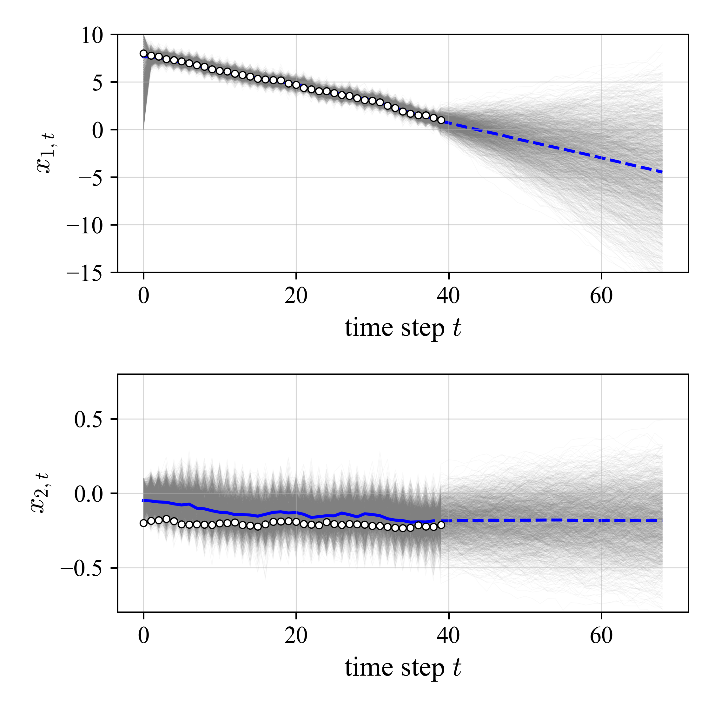
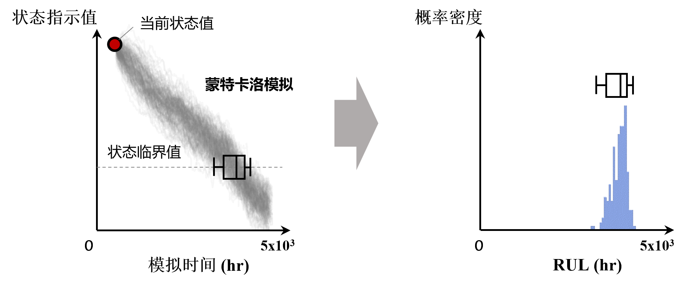

#! https://zhuanlan.zhihu.com/p/661432829
### 基于粒子滤波的线性系统退化状态估计

#### 一、系统和问题描述

某线性系统状态变化相关变量之间满足如下时序关系：

$$
\vec{x}_{t} = \begin{bmatrix}1 &1\\0 &1\end{bmatrix} \cdot \vec{x}_{t-1} + \vec{\varepsilon}_{{\rm sys},t-1} \tag{1}
$$

$$z_{t} = \begin{bmatrix}1 &0\end{bmatrix} \cdot \vec{x}_{t} + \varepsilon_{{\rm obs}, t} \tag{2}
$$

其中，向量 $\vec{x}_{t}$ 中包含了例如压缩机效率与标准水平差异值、转动件的振动等级值、涡轮出口温度与标准水平差异值等实时状态指示值（condition indicator, CI） $x_{1,t}$ 和及其在每个离散时间区间内的退化速度 $x_{2,t}$，即 $\vec{x}_{t} = [x_{1,t}, x_{2,t}]^T$；$\vec{\varepsilon}_{{\rm sys},t-1}$ 和 $\varepsilon_{{\rm obs}, t}$ 分别为对应的系统噪声和观测噪声。最后，$z_t$ 表示此时系统状态指标的实际观测值。

本案例设置：

* 状态指标 $\vec{x}_t$ 的初始值为 $\vec{x}_0 = [8, -0.02]$
* 系统噪声 $\varepsilon_{{\rm sys}, t}$ 各自符合均值为0、标准差分别为0.1和0.01的正态分布，即
  $$
  \vec{\varepsilon}_{1, {\rm sys}, t} \sim {\rm Norm}(0, 0.1) \tag{3}
  $$

  $$
  \vec{\varepsilon}_{2, {\rm sys}, t} \sim {\rm Norm}(0, 0.01) \tag{4}
  $$

* 观测噪声符合均值为0、标准差为0.1的正态分布：
  $$
  \varepsilon_{{\rm obs}, t} \sim {\rm Norm}(0, 0.1) \tag{5}
  $$

基于以上设置，通过40步迭代便可模拟获得一组退化曲线观测样本 $\vec{z} = \{z_0, z_1, ..., z_{40}\}$。

**本案例将考虑**，基于观测样本 $\vec{z}$ 以及式(1) ~ (5) 中各变量与噪声之间的关系：
1. 对 $\vec{z}$ 进行滤波，获得系统真实值序列 $\vec{x} = \{x_0, x_1, ..., x_{40}\}$
2. 对未来系统退化状态 $x$ 的变化进行估计

#### 二、基于粒子滤波的退化状态估计和预测

不同于上一篇[文章](https://zhuanlan.zhihu.com/p/656306252)案例中 $x$ 是标量，本案例中带估计量 $\vec{x}_t$ 是二维的，观测值 $z_t$ 是一维的。因此，在进行粒子滤波初始化设置时，我们使用```n_marg_particles```表示每个维度上的颗粒数，系统总颗粒数即为```n_marg_particles**2```。每个颗粒对应的 $x$ 值也是二维的，包含了当前状态指标 $x_1$ 和退化速度 $x_2$。

接下来，设置好各维度上粒子取值的边界```x_range = [[0, 10], [-0.2, 0.1]]```，使其能够完整覆盖所有观测样本，便于后续概率密度计算和重采样，然后通过```np.meshgrid()```生成二维均匀网格分布的初始粒子群。

剩下的步骤便是按照时间步循环地对粒子进行前向计算 $\rightarrow$ 概率权重计算 $\rightarrow$ 重要性采样，最终获得各时刻的粒子集合```particles```以及对应的状态滤波结果```x_filtered```，最后对未来一段时期 $x$ 的变化进行递推预测。方法原理请见上一篇[文章](https://zhuanlan.zhihu.com/p/656306252)内容。

需要注意的是，在本节状态估计和预测中所设置的系统和观测噪音参数与第一节模拟所用的真实值不同，分别为```sys_noise_std = [0.3, 0.03]```以及```obs_noise_std = 0.3```。这是为了模拟在实际状态估计中，人们只能对噪声系数进行大致地估计，同时，粒子滤波结果对噪声参数的设置具有一定的鲁棒性，因此，粒子滤波中所采用的噪声参数不一定需要十分准确。

#### 三、结果讨论

下图显示了本案例的最终效果。上图和下图分别对应于系统状态指标 $x_1$ 以及退化速度 $x_2$。每张图中，白色原点为前40步所采集的状态指标和退化速度样本；灰色细线表示每个颗粒对应值在所有时刻变化的轨迹，轨迹越密集表示对应区域取值可能性越高；蓝色实线为所得的滤波曲线（即所有粒子轨迹的均值曲线）；$t\geq 40$ 步之后的灰色和蓝色曲线即为算法对系统未来状态指标和退化速度变化的预测结果。可见，滤波算法认为系统会保持稳定的线性退化趋势（$x_1$ 线性衰减且 $x_2$ 平稳）。但从所有灰色曲线的方差变化可见，由于系统噪声的存在，状态指标随时间变化的不确定性也在逐渐增加。

<!-- <div align=center>

</div> -->

以上滤波和预测结果可以帮助我们获得：
1. 系统在未来一段时期内失效（即到达设定的状态临界值）的可能性
2. 系统未来失效时间即剩余寿命RUL的分布（即通过蒙特卡洛模拟获得各粒子曲线达到失效状态临界值的时间分布），如下图所示：

<!-- <div align=center>

</div> -->

#### 四、案例代码

```python
from scipy import stats
import numpy as np
import sys
import os

BASE_DIR = os.path.abspath(os.path.join(os.path.abspath(__file__), "../" * 3))
sys.path.insert(0, BASE_DIR)

from setting import plt

# 机理参数
A = np.array([[1, 1], [0, 1]])
B = np.array([[1, 0]])


def _get_accum_weights(weights):
    """将权重转化为累计值"""
    accum_weights = weights.copy()
    for i in range(len(weights) - 1):
        accum_weights[i] = np.sum(weights[: i + 1])
    accum_weights[-1] = np.sum(weights)
    accum_weights /= (accum_weights[-1])
    return accum_weights


def resample(particles, weights):
    """重要性采样"""
    accum_weights = _get_accum_weights(weights)

    rand_nums = np.random.random(len(weights))
    particles_resampled = None
    for num in rand_nums:
        probs_sort = np.sort(np.append(accum_weights, num))
        insert_idx = np.argwhere(probs_sort == num)[0][0]
        
        particles_resampled = particles[insert_idx, :] if particles_resampled is None \
            else np.vstack((particles_resampled, particles[insert_idx, :]))
    
    return particles_resampled


def gen_data(sys_noise_std, obs_noise_std, N):
    """生成模拟数据"""
    sys_noise = np.random.normal(0, sys_noise_std)
    obs_noise = np.random.normal(0, obs_noise_std)
    x_init = np.array([[8, -0.2]]).T  # 当前设备健康指数、健康指数退化速度
    y_init = np.dot(A, x_init) + sys_noise.reshape(2, 1)
    z_obs_init = np.dot(B, y_init) + obs_noise
    
    x_series = x_init            # 状态值
    z_obs_series = z_obs_init    # 观测值
    
    for _ in range(N - 1):
        sys_noise = np.random.normal(0, sys_noise_std)
        obs_noise = np.random.normal(0, obs_noise_std)
        
        xi = x_series[:, [-1]]
        yi = np.dot(A, xi) + sys_noise.reshape(2, 1)
        zi_obs = np.dot(B, yi) + obs_noise
        
        x_series = np.hstack((x_series, yi))
        z_obs_series = np.hstack((z_obs_series, zi_obs))
        
    return x_series, z_obs_series


if __name__ == "__main__":
    N = 40
    sys_noise_std = [0.1, 0.01]
    obs_noise_std = 0.1
    
    x_series, z_obs_series = gen_data( sys_noise_std, obs_noise_std, N)
    
    plt.figure(figsize=(5, 5))
    plt.plot(x_series[0, :])
    # plt.plot(x_series[1, :])
    plt.plot(z_obs_series[0, :])
    plt.show()
    
    # ---- 粒子滤波 ---------------------------------------------------------------------------------
    
    n_marg_particles = 41  # 各边际上的颗粒数
    sys_noise_std = [0.3, 0.03]
    obs_noise_std = 0.3
    
    x_range = [[0, 10], [-0.2, 0.1]]  # NOTE: 需要涵盖样本
    x_grids = np.meshgrid(
        np.linspace(x_range[0][0], x_range[0][1], n_marg_particles),
        np.linspace(x_range[1][0], x_range[1][1], n_marg_particles))
    
    x_filtered = None
    particles_lst = []
    for loc in range(N - 1):
        print(f"loc = {loc}, \ttotal = {N - 1} \r", end="")
        
        # 根据离散化网格初始化粒子集
        if loc == 0:
            particles = np.c_[x_grids[0].flatten(), x_grids[1].flatten()]
        
        particles_lst.append(particles)
            
        # 输出观测值
        z_obs = z_obs_series[:, loc + 1]
        
        # 前向并计算权重
        weights = np.array([])
        for xi in particles:
            xi = xi.reshape(2, 1)
            sys_noise = np.random.normal(0, sys_noise_std)
            obs_noise = np.random.normal(0, obs_noise_std)

            # 预测：前向计算
            yi = np.dot(A, xi) + sys_noise.reshape(2, 1)
            zi = np.dot(B, yi)

            # 校正：根据输出与观测的匹配程度，计算各粒子的重要度权重 wi = p(y_obs|xi)
            wi = stats.norm.pdf(z_obs.flatten(), zi.flatten(), obs_noise_std)[0]
            weights = np.append(weights, wi)
            
        # 重要性采样
        particles_resampled = resample(particles, weights)
        
        # 记录本环节输入状态值期望 E[x_sys]
        a = np.mean(particles_resampled, axis=0).reshape(2, 1)
        x_filtered = a if x_filtered is None else np.hstack((x_filtered, a))
        
        # 更新粒子: 预测下一时刻的N个粒子
        sys_noise = np.vstack((
            np.random.normal(0, sys_noise_std[0], n_marg_particles ** 2),
            np.random.normal(0, sys_noise_std[1], n_marg_particles ** 2)
        ))
        particles = np.dot(A, particles_resampled.T).T + sys_noise.T
    
    # ---- 进行外推 ---------------------------------------------------------------------------------
    
    N_pred = 30
    x_pred, x_std_pred = [], []
    for _ in range(N_pred):
        sys_noise = np.vstack((
            np.random.normal(0, sys_noise_std[0], n_marg_particles ** 2),
            np.random.normal(0, sys_noise_std[1], n_marg_particles ** 2)
        ))
        particles = np.dot(A, particles.T).T + sys_noise.T
        particles_lst.append(particles)
        
        x_pred.append(np.mean(particles, axis=0))  # 本环节输入状态值期望 E[x_sys]
        x_std_pred.append(np.std(particles, axis=0))
    
    x_pred, x_std_pred = np.array(x_pred), np.array(x_std_pred)
    
    # ---- 画图 -------------------------------------------------------------------------------------
    
    # 总体分布
    plt.figure(figsize=(5, 5))
    plt.subplot(2, 1, 1)
    plt.scatter(
        range(x_series.shape[1]), x_series[0, :], marker="o", s=12, c="w", edgecolors="k", lw=0.6, 
        zorder=2)
    plt.plot(range(N - 1), x_filtered[0, :], "b-", zorder=1)
    plt.plot(range(N - 1, N + N_pred - 1), x_pred[:, 0], "b--", zorder=1)
    plt.xlabel("time step $t$")
    plt.ylabel("$x_{1,t}$")
    
    # 各粒子的轨迹
    for i in range(n_marg_particles ** 2):
        plt.plot([p[i, 0] for p in particles_lst], c="grey", alpha=0.05, lw=0.3, zorder=-2)
    plt.ylim([-15, 10])
    plt.grid(True, linewidth=0.5, alpha=0.5)
    
    plt.subplot(2, 1, 2)
    plt.scatter(
        range(x_series.shape[1]), x_series[1, :], marker="o", s=12, c="w", edgecolors="k", lw=0.6,
        zorder=2)
    plt.plot(range(N - 1), x_filtered[1, :], "b-", zorder=1)
    plt.plot(range(N - 1, N + N_pred - 1), x_pred[:, 1], "b--", zorder=1)
    plt.xlabel("time step $t$")
    plt.ylabel("$x_{2,t}$")
    
    # 各粒子的轨迹
    for i in range(n_marg_particles ** 2):
        plt.plot([p[i, 1] for p in particles_lst], c="grey", alpha=0.05, lw=0.3, zorder=-2)
    plt.ylim([-0.8, 0.8])
    plt.grid(True, linewidth=0.5, alpha=0.5)
    
    plt.tight_layout()
    plt.savefig("img/设备退化曲线.png", dpi=450)
    plt.show()
```