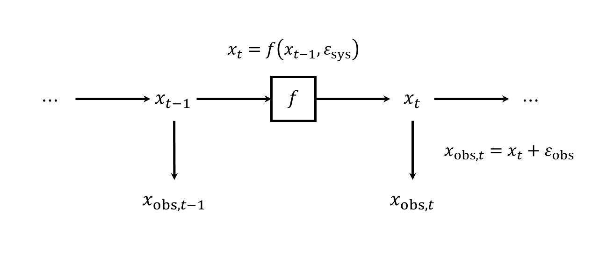
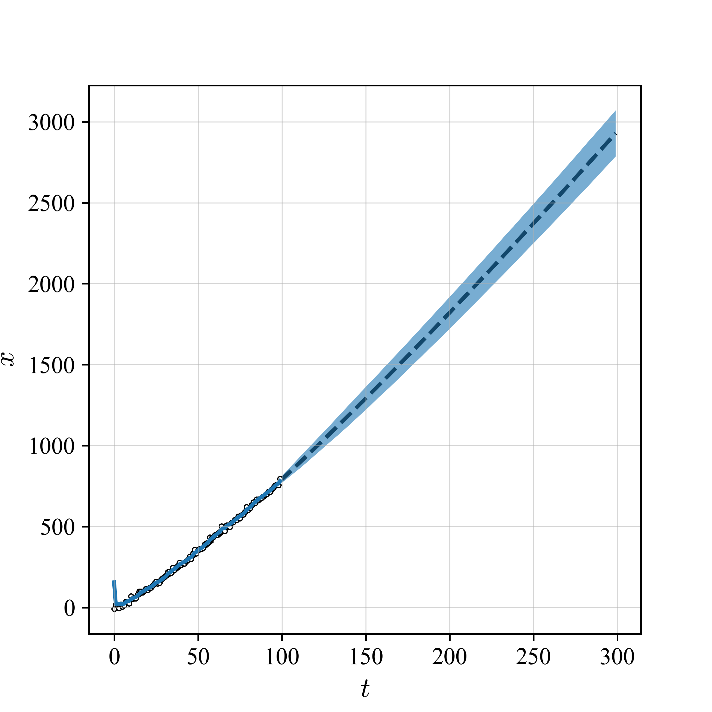

#! https://zhuanlan.zhihu.com/p/656306252
### 粒子滤波

本文简单理解了下粒子滤波（particle filter, PF）的原理，其中可能存在一些问题，待后续讨论修改和补充。

#### 一、忽略时间：从对输入的估计讲起

##### 1.1 问题描述
下图显示了某过程中输入变量 $x$ 经状态转移关系 $f$（由线性或非线性机理决定）的作用变化为 $y$ 的原理。下方的 $x_{\rm obs}$ 和 $y_{\rm obs}$ 则显示了对应输入输出变量的观测值。此过程主要存在两类的噪声：

1. 过程噪声：$\varepsilon_{\rm sys}$
2. 观测噪声：$\varepsilon_{{\rm obs},x}$、$\varepsilon_{{\rm obs},y}$

问题：在已知过程变量输入输出关系 $f$ 以及 输出观测值 $y_{\rm obs}$ 的前提下，如何对过程输入 $x$ 进行估计？

##### 1.2 基于重要性采样对输入分布进行求解的原理

从上图可知，带估计输入 $x$ 与输出观测值 $y_{\rm obs}$ 之间存在如下关系：

$$
x \rightarrow f(x, \varepsilon_{\rm sys}) \rightarrow y \rightarrow y_{\rm obs} \tag{1}
$$

因此，可以**事先**生成一批 $M$ 个待考察的输入样本 $\bold x=x_1,\cdots,x_M$。对于每个样本 $x_i (1 \leq m \leq M)$，按照上述流程计算获得对应的输出观测值 $y_i$，并根据 $y_i$ 与实际观测结果 $y_{\rm obs}$ 之间的差异获得其对应的 $x_i$ 的概率权重 $w_i$。最后，按照 $\bold w =w_1, \cdots, w_M$ 对 $\bold x$ 中各样本进行重采样获得输入的后验分布样本 $\bold x'$，并进一步获得相关的统计量。

##### 1.3 一个非线性过程的简单算例

下面根据1.2节中的思路实现对一简单非线性过程输入估计的算例。该过程方程为：

$$
f(x) = 2 x^3 + 3x^2 - 12x + 3
$$

$$
y = f(x) + \varepsilon_{\rm sys}
$$

$$
y_{\rm obs} = y + \varepsilon_{{\rm obs}, y}
$$

其中，过程噪声和观测噪声均满足高斯分布：

$$
\varepsilon_{\rm sys} \sim {\rm Normal}(0, 1)\\
\varepsilon_{{\rm obs}, y} \sim {\rm Normal}(0, 2)
$$

本案例设置观测值为 $y_{\rm obs} = 10$。下图显示了 $f(x)$ 函数（黑色曲线）、考虑噪声情况下的观测值曲线（散点）以及观测值 $y_{\rm obs}$ 的位置（红色实线）。可见，对应于 $y_{\rm obs}$ 的输出可能在存在三种状态，$x \approx -3$、$-1$ 或 $2$。

接下来，基于 $x$ 离散样本（即粒子）的**重要性采样**对输入的分布进行更准确的估计：

1. 设置粒子总数 $M=10000$，获得 $[-5, 5]$范围内均匀分布的粒子样本 $\bold x=x_1,\cdots,x_{M=10000}$
2. 前向计算：根据式(1)获得输出观测样本 $\bold y = y_1, \cdots, y_{M}$
3. 计算粒子权重 $\bold w = w_1, \cdots, w_{M}$，其中 $w_i = p(y_i|y_{\rm obs})$
4. 重采样：根据 $\bold w$ 采用**轮盘赌算法**对 $\bold x$ 进行重采样，获得后验分布样本 $\bold x'$，其中 $x_{i}' \sim p(x|y_{\rm obs})$

最终估计效果如下：

左图显示了基于输出观测值 $y_{\rm obs}$ 获得的重要性采样结果中输入后验分布概率密度 $p(x|y_{\rm obs})$，即 $x' \sim p(x|y_{\rm obs})$。重要性采样算法找出了过程的所有可能输入状态；右图则显示了对重要性采样后验估计的验证结果：将后验样本 $x_{i}' \in \bold x'$ 逐一带入式(1)进行前向计算所得的输出观测值分布 $p(y_{\rm obs}|\bold x')$。可见，$p(y_{\rm obs}|\bold x')$ 分布的最大后验估计MAP位于实际观测值 $y_{\rm obs} = 10$ 附近，表明了重要性采样估计的准确性。

#### 二、考虑时间：过程信号滤波

##### 2.1 粒子滤波原理

对于一个简单的时序过程，可以认为过程变量 $x$ 在相邻时刻存在如下关系：

$$
x_t = f(x_{t-1}, \varepsilon_{\rm sys})
$$

仿照第一节讨论，可得下图：

此时的滤波是在已知或设定好过程函数 $f$、噪声水平 $\varepsilon_{\rm sys}$ 和 $\varepsilon_{\rm obs}$后，根据 $x$ 的一系列观测值 $\bold x_{\rm obs} = \cdots, x_{{\rm obs},t-1}, x_{{\rm obs},t}, \cdots$ 获得对其真实值 $\bold x = \cdots, x_{t-1}, x_{t}, \cdots$ 的估计。
估计方式：对每个时刻 $t$，采用第一节中所介绍的方式通过观测值 $x_{{\rm obs},t}$ 对上一时刻状态 $x_{t-1}$ 进行估计，即获得后验概率 $p(x_{t-1}'|x_{{\rm obs},t})$ 以及对应的最大后验估计值 $x_{{\rm MAP}, t-1}'$。同时，根据 $p(x_{t-1}'|x_{{\rm obs},t})$ 对 $x_t$ 进行重采样，更新粒子集，进而对 $t$ 及之后的滤波实现递推。最终获得所有时刻的MAP结果 ${\bold x}_{\rm MAP}' = \cdots, x_{{\rm MAP}, t-1}', x_{{\rm MAP}, t}', \cdots$作为滤波后结果。

##### 2.2 粒子滤波案例

考虑如下简单的一维时序过程（注意：**该过程可以非平稳**）：

$$
x_t = x_{t-1} + 1 + \varepsilon_{\rm sys}
$$

$$
x_{t, \rm obs} = x_t + \varepsilon_{\rm obs}
$$

其中，过程噪声和观测噪声均满足高斯分布：

$$
\varepsilon_{\rm sys} \sim {\rm Normal}(0, 0.1) \\
\varepsilon_{\rm obs} \sim {\rm Normal}(0, 10)
$$

设定粒子数 $M=1000$进行滤波，得到结果如下：

其中，散点显示了随时间采集所得样本点 ${\bold x}_{\rm obs}$，黑色虚线表示 $x$ 随时间 $t$ 的实际变化关系，蓝色实线显示了粒子滤波所得结果。可见，滤波结果与实际关系接近。

#### 三、总结

粒子滤波使用条件：

1. 状态转移关系 $f$ 已知，可与过程的动态机理结合
2. 过程和观测噪声水平 $\varepsilon_{\rm sys}$ 和 $\varepsilon_{\rm obs}$ 已知

待讨论：

1. 高维过程应用
2. 求解效率问题
3. 与其他马尔科夫链蒙特卡洛采样方法的性能对比

